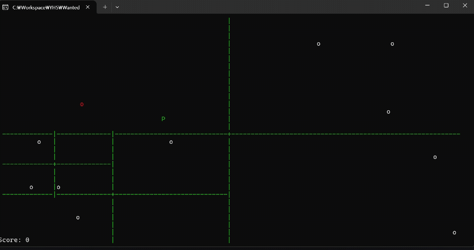

# 쿼드트리 충돌 시각화 프로젝트

## 프로젝트 소개

Windows Console 환경에서 동작하는 자체 2D 게임 엔진 위에 QuadTree 공간 분할 알고리즘을 적용하여 충돌 검사를 최적화한 프로젝트입니다.

QuadTree 구축, 충돌 후보군 검색(Broad Phase), 실제 충돌 판정(Narrow Phase), 그리고 내부 동작 시각화 기능을 직접 구현했습니다.

## 프로젝트 정보

* 개발 기간 : 2026.03.04 ~ 2026.03.09
* 개발 인원 : 1인
* 사용 기술 : C++
* 플랫폼 : Windows Console

---

## 핵심 구현

### QuadTree 공간 분할

* QuadTree 및 Node 클래스 직접 구현
* 객체 위치 기반 공간 분할
* 동적 트리 생성 및 갱신

### Broad Phase / Narrow Phase

* 플레이어 주변 객체만 검색
* 후보군 객체에 대해서만 실제 충돌 판정 수행
* 불필요한 충돌 검사 감소

### 알고리즘 시각화

* 콘솔 상에 QuadTree 분할 영역 렌더링
* 검색된 충돌 후보군을 색상으로 표시
* 공간 분할 과정을 실시간 확인 가능

---

## 트러블슈팅

### 분할 경계 객체 검색 누락 문제

QuadTree 분할 경계에 걸친 객체가 특정 노드에만 저장되면서 검색에서 누락되는 문제가 발생했다.

이를 해결하기 위해 객체가 여러 영역에 걸칠 경우 해당 자식 노드들에 모두 삽입하는 Multi-Insertion 방식을 적용했다.

그 결과 충돌 누락 현상을 제거하고 시각화 결과와 실제 충돌 결과를 일치시킬 수 있었다.

---

## 회고

QuadTree 적용 자체보다도, 자료구조를 실제 게임 루프에 통합하고 디버깅하는 과정에서 공간 분할 알고리즘의 장단점을 경험할 수 있었다.

또한 매 프레임 트리를 재생성하는 구조의 한계를 확인하며 Object Pooling을 통한 메모리 재사용의 필요성을 확인할 수 있었다.
